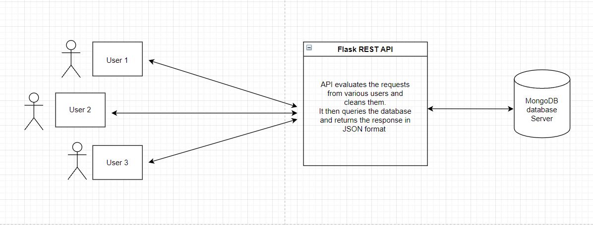
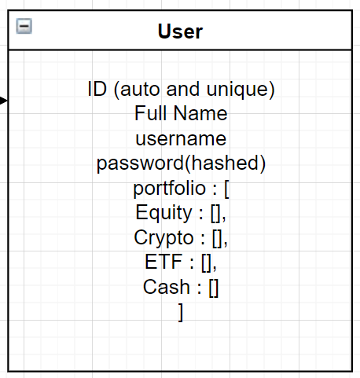
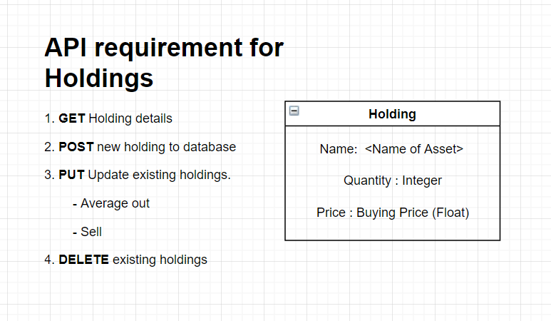
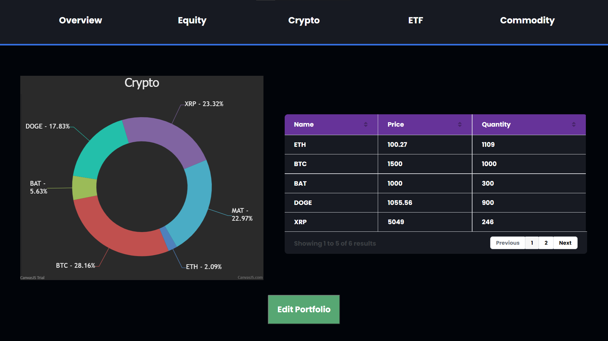
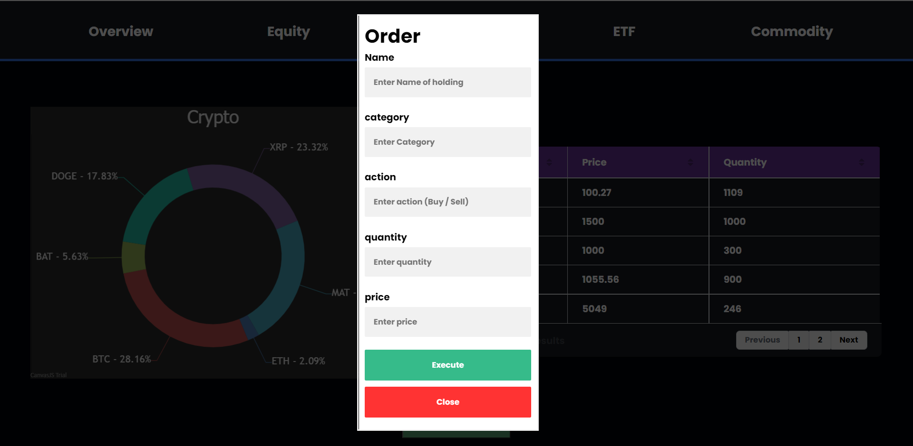
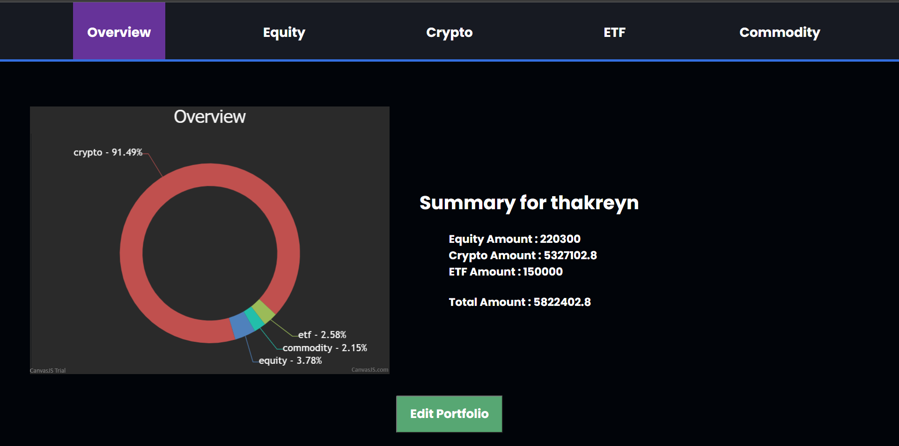

# DBMS Project

## Portfolio Dashboard using MongoDB 

Creating a simple web dashboard to visualize or monitor/track your personal portfolio. 

## Technologies Used:
Python-Flask, REST API, MongoDB, Javascript.

## Flow
The app uses a simple HTML and JS frontend that sends API requests to a Flask REST API that evaluates the request and depending on the request, queries the mongodb database and returns a suitable response.

## API Requirements:

The REST API has 2 Resources:

1. User (Represents a user portfolio)

    

2. Holding (Represents a single holding)

    

## UI (Sample values)

1. Dashboard:
    

2. Order Placement:
    
3. Overview:
    